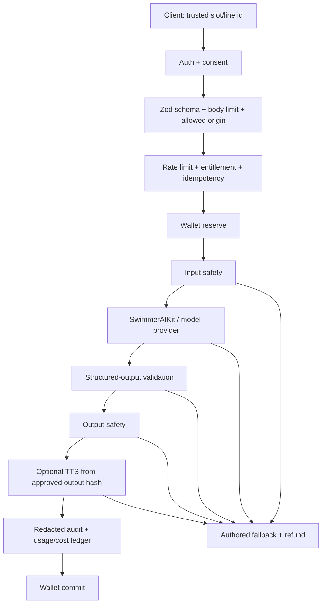

# SupaLuv 商业完成态审计（2026-07）— ARCHIVED

> **Do not treat this file as product truth.** Owner-approved subset:
> `docs/reference/strategy/owner-approved-audit-extract-2026-07.md` + `ADR-0003`.
>
> 审计性质：外部 review-only 意见（2026-07-10 快照）。含已被否决的定价/冻结主张。

## 0. 先给结论

SupaLuv 现在不缺“骨架”，反而已经拥有超出当前验证阶段所需的骨架：账号、钱包读数、AI 支线、双路 TTS、同玩、全局选择统计、图鉴、成就、存档、音频总线、角色替换、语言壳、章节结算等都已出现。

真正的商业风险是：

> **放映机已经很豪华，但还没有证明观众愿意为里面那部电影买票。**

未来 90 天不应再追求“功能完成度”，而应只证明一个问题：

> 一段 25–35 分钟、正式世界观、正式文本、正式美术方向的成人科幻黑色爱情喜剧，能否让目标玩家完成、记住、分享、重玩，并愿意为完整作品付费；AI 是否真的让这些指标更好。

我的首要建议不是再加功能，而是立即做四件事：

1. 修复第一处选择裁切、手机短屏裁切、存档恢复空场景、页面滚动串页四个体验阻塞。
2. 冻结联网同玩、全局统计、捏脸、全量 TTS、移动商店、更多成就/图鉴等扩张。
3. 把 Chapter 01 从“非正式工作稿”变成真正可卖的垂直切片，并完成真人英语编辑。
4. 做一次 AI 开/关对照测试，证明 AI 对重玩、分享或购买意向至少有可测的增量；证明不了，就把 AI 降级为可选演出层，不围绕它建设经济系统。

## 1. 我实际检查了什么

### 1.1 真实试玩

我通过本地浏览器走了以下旅程：

```text
Boot → Title → Settings → New Game → Cold Open → Dialogue → First Choice
→ Four-choice Screen → Save/Resume → Event CG → Chapter Ending
→ Gallery → Achievements → Help → Mobile Portrait → Short Landscape
```

证据在：

- [ScreenWalk Owner Review Brief](../../../artifacts/quality-loop/tmp/2026-07-10-commercial-completion-audit/owner-review-brief.md)
- [Evidence Packets](../../../artifacts/quality-loop/tmp/2026-07-10-commercial-completion-audit/evidence-packets.json)
- [Screenshot Index](../../../artifacts/quality-loop/tmp/2026-07-10-commercial-completion-audit/screenshot-index.md)

### 1.2 工程验证

在审计快照中：

| 检查 | 结果 | 解释 |
| --- | --- | --- |
| `pnpm typecheck` | 通过 | TypeScript 主路径可编译。 |
| `pnpm test` | 通过，21 个文件 / 76 个测试 | 逻辑单测基础不错。 |
| `pnpm lint` | 通过 | 静态规则无阻塞。 |
| `pnpm build` | 通过 | Web 可构建；主 JS chunk 约 878.74 kB，gzip 约 248.45 kB，并有 chunk 警告。 |
| `pnpm test:e2e` | 失败 | 新增 Boot Splash 后，E2E 仍直接等待 Title；尚未进入后续商业流程断言。 |
| 本地运行日志 | 有降级噪音 | AI service 未运行时，choice-stats 代理重复 `ECONNREFUSED 127.0.0.1:8787`；UI 用本地/演示基线降级。 |

“单测通过”不等于“玩家能玩”。这次最严重的选择裁切就是典型例子：代码没有崩，按钮也存在，但玩家看不到完整内容。

### 1.3 内容快照

截至快照：

- `ch01.ink` 约 8,837 个字符、40 个 knots、49 条 choice lines、8 个真正有多个选择的段落、3 个 AI anchor。
- Chapter 01 小说草稿 `wc -m` 为 3,119 个字符；`WORD-COUNT.md` 写“~3500+”，存在轻微事实漂移。
- 已出现 `SERIES-BIBLE.md`、30 章地图、连续性日志、小说→剧本→Ink 的工作流，这是正确方向。
- 这些内容仍明确标记为 working draft / 非正式 canon；目前只证明“可以写出一个有声音的第一章草稿”，还没有证明 30 章吞吐、英语喜剧、本地化质量或玩家购买意愿。

## 2. 最值得保留的东西

这不是一个“推倒重来”的建议。项目已有几项真正有价值的资产：

1. **作者声音有辨识度。** “羞耻像 P0”“不嫌弃成为付费功能”“订单是发光罪证”这类表达能形成黑色喜剧记忆，不是普通 AI 恋爱模板。
2. **Ink 主线 + 受约束 AI 支线的方向正确。** 作者控制 canon，AI 只短暂即兴并回归主线，质量、安全、成本与迁移性都更可控。
3. **章节末“订单/回执”卡是目前最强的商业表面。** 它能把玩家路径变成可分享的纪念物，应该升级为品牌签名，而不是被埋在大量 meta 功能之后。
4. **Pie 技术方向基本对齐。** Vite + React + TypeScript、SwimmerUIKit、SwimmerAIKit、SwimmerCore、PostHog、Vitest、Playwright 都符合项目政策。
5. **分析埋点的隐私边界不错。** typed allowlist、不上传故事正文/提示词/PII、关闭 autocapture 和 session recording，是值得保留的做法。
6. **内容安全原则明确。** 成人性喜剧可以尖锐、暧昧、尴尬，但不做自由色情生成器、AI 性伴侣或色情工作室。这既是产品定位，也是平台生存边界。

## 3. GoalCascade：接下来 90 天到底为了什么

### Layer 1 · Doctrine / Mission Adapter

结论：SupaLuv 属于 Pie 产品体系，商业成功允许且必要，但不能靠隐藏费用、恐惧、色情诱导、无限依赖或模糊 AI 边界赚钱。

对下层的约束：拒绝“核心剧情走到一半突然投币”“失败也扣费”“电池过期”“把玩家诱导成 AI 陪伴依赖”等方案。

### Layer 2 · Product Role

结论：当前角色是 **商业垂直切片与市场验证实验**，不是成熟现金流产品、多人平台或移动端内容平台。

对下层的约束：本阶段只投资能验证故事吸引力、AI 增量、完成率、分享与购买意向的能力。

### Layer 3 · Phase Goal

结论：未来 90 天证明一段 25–35 分钟正式体验是否值得扩成完整商品。

明确不是当前目标：完整 30 章、移动商店、全角色配音、跨端云存档、联网同玩商业化、通用电池商城、完整社区。

### Layer 4 · Target / Non-target

目标用户：

- 英语市场为主、18+、PC/Web/Steam；
- 喜欢怪诞成人喜剧、关系尴尬、故事型独立游戏；
- 接受实验性 AI，但首先在乎角色、写作与后果；
- 愿意玩 20–60 分钟的短篇/章节式叙事体验。

非目标用户：

- 寻找自由色情生成、AI 性伴侣或无限聊天的人；
- 以多人竞技、长期养成、手游日活为核心期待的人；
- 不能接受 AI 参与任何内容的人；
- 当前阶段的竖屏移动休闲用户。

### Layer 5 · Win Logic

我们靠以下组合赢：

1. 独特、持续的人类作者声音；
2. 成人但不露骨的黑色关系喜剧；
3. AI 不是无限胡写，而是在关键时刻即兴一次，并被后续正式剧情记住；
4. “订单/回执/事故报告”式可分享结局；
5. 对安全、成本和平台边界的克制。

明确不靠以下东西赢：供应商数量、功能最多、自由度无限、色情尺度最大、实时多人、全平台首发。

可参考但不照抄：

- [Monster Prom](https://store.steampowered.com/app/743450/Monster_Prom/) 证明大胆成人喜剧、鲜明角色、可重玩与同玩可以组成明确卖点；但 SupaLuv 现在不应复制它的多人规模。
- [Slay the Princess](https://store.steampowered.com/app/1989270/Slay_the_Princess/) 的商店表达把“鲜明写作、独特美术、完整配音、真正分支”放在中心，系统数量反而不是主叙事。
- [AI2U](https://store.steampowered.com/app/2880730/AI2U_With_You_Til_The_End/) 明确披露运行时 LLM/TTS，同时强调美术、故事设计和世界观由人类创作；这是比“AI 做了一切”更健康的表达。

### Layer 6 · Economy / Charging

结论：先卖完整故事，不先卖模型调用。

- 免费 Demo：完整展示一次或两次 AI 卖点，不卖电池。
- 付费本体：包含全部作者主线、标准结局，以及正常首轮游玩所需的 AI 生成额度。
- 未来电池：只考虑“再演一次”“导演剪辑式额外插曲”“额外生成纪念物”等增量价值。
- 不做订阅；短篇单机叙事和订阅天然错配。
- 价格只做实验：`$12.99 / $14.99 / $17.99` 三点测试，不在没有正式 Demo 数据时拍脑袋定价。

### Layer 7 · Principles / No-go Zones

原则：

1. 故事先于技术名词。
2. AI 必须留下可见后果，否则只是烟花。
3. 玩家在第一次体验核心价值之前不被登录、付费或设置面板拦住。
4. 每个实时 AI 动作都有 fallback、上限、追踪和退款路径。
5. 只承诺当前构建真正提供的语言、平台和内容。

禁止动作：

1. 用新功能掩盖低完成率或低购买意向。
2. 宣传“无限 AI 结局”却只提供两句临时旁支。
3. 让登录用户向 TTS 端点提交任意文本并直接生成声音。
4. 把 Web 购买的通用电池直接当作 Steam/Apple/Google 可自由消费的货币。
5. 在正式美术、正式内容、无阻塞 QA 之前消耗唯一一次 Steam Next Fest 机会。

### Layer 8 · Success / Stop Conditions

成功不是“上线了更多模块”，而是目标玩家完成、理解、分享并愿意付钱。具体门槛见第 14 节。

停止或降级条件：若 AI 开启组没有带来至少 5 个百分点的重玩/高意向增量，则 AI 降级为可选演出；若公开流量完成率低于 35%，冻结平台与功能扩张，先重写开场/节奏；若正常通关的实时 AI 成本超过净收入 5%，减少动态生成或转预生成。

## 4. 推荐的外部定位

中文：

> 一部由人类作者写成的成人科幻黑色爱情喜剧；在最尴尬的关头，AI 会即兴演出一次你无法完全预料、但会被故事记住的后果。

英文：

> A human-authored adult sci-fi disaster rom-com where AI improvises one consequence the story remembers.

不要把首屏定位写成：

- AI 成人视觉小说；
- 无限 AI 结局；
- AI 恋人；
- 任意幻想都能生成。

那些说法会同时吸引错误用户、激怒重视作者性的视觉小说玩家，并增加平台审核风险。

## 5. 玩家体验审计：当前最严重的问题

### P0 / 发布阻塞

#### 5.1 第一处选择被裁切（SW-001）

在 1280×720 的默认桌面视口，实测 dialogue box 的可见高度小于 scrollHeight，story-copy 一度只有约 18px 可见高度，选项堆栈越出舞台底部；四选项场景中第 4 项不可见。

根因不是“屏幕太小”，而是布局合同自相矛盾：dialogue box 被限制在舞台高度约一半，内部又放入固定高度的 nameplate、文本、多个按钮，最外层还 `overflow: hidden`。CSS 注释写“options always stay on-card”，实际证据证明相反。

发布门：除了视觉回归，还要自动断言：

```text
storyCopy.scrollHeight <= storyCopy.clientHeight + tolerance
choiceStack.bottom <= stage.bottom
每个 choice locator 都 visible 且可点击
```

#### 5.2 竖屏移动不可用（SW-002）

390×844 下，16:9 舞台只是缩成约 379×213 的小长方形，四周大量黑边，文本、按钮和人物同时被压缩。

初学者比喻：这就像把电影院银幕整体缩到手机中间，而不是为手机重新排版。它“比例正确”，但不等于“能看”。

当前阶段建议：明确横屏提示 + 短屏布局修复；不要声称支持竖屏。真正竖屏版是另一套构图、HUD 和对话设计，不是加一个 media query。

#### 5.3 存档恢复出现空场景（SW-004）

Continue 曾恢复到只有占位剪影、“场景 / 旁白 / 继续”的空画面，再推进一次后恢复。

代码层的高概率原因：Ink state 能恢复，但 `readSnapshot()` 只从恢复后继续产生的新行和当前 tags 重建 `sceneId/text`；若存档正好停在 choice boundary，当前 presentation 不一定能从 tags 还原。

发布门：每个 authored choice、AI rejoin、cutscene 前后、章节末都要做 save→new runner→load→snapshot 等价测试；恢复正确率必须 100%。

### P1 / 高优先级

#### 5.4 页面切换继承滚动位置（SW-005）

Gallery 滚动后打开 Achievements/Help，新页面会从中段开始，标题甚至在视口上方。`App.tsx` 用本地 `screen` 状态直接切组件，没有统一的 scroll/focus reset。

不需要立刻引入 React Router。先做一个很小的 `navigate(nextScreen)` 包装，负责 setScreen、`scrollTo(0,0)`、把焦点移到新页面标题。只有未来真的需要深链接、浏览器返回、商店 checkout callback 时再引入路由库。

#### 5.5 Settings 是开发控制台，不是玩家设置（SW-006）

玩家能看到 SwimmerCore、VITE 环境变量、MiniMax/ElevenLabs、模型试听、WIP 语言、原生文件上传、商业壳 skeleton、未来才接线的无障碍/法律内容。

建议拆成：

- Player Settings：音量、文字速度、自动播放、字号、高对比、减少动效、语言（只显示真正可用的）。
- Account & Privacy：只在使用联网功能后出现。
- Developer Lab：provider 试听、立绘包、逻辑 ID、环境健康度；生产构建隐藏。

#### 5.6 Help 含内部术语和错误陈述（SW-007）

Help 里出现 B7、Supabase key、logical ID、mock 等内部词；并声称无网络/无 key 会自动 mock，但代码只有 `VITE_SUPALUV_AI_FORCE_MOCK=1` 才使用 mock。

生产 Help 只回答玩家问题：怎么推进、怎么保存、AI 是什么、AI 失败会怎样、数据会发给谁、如何反馈/举报、内容警告在哪里。

#### 5.7 Cutscene 像测试演示（SW-008）

“事件 CG · Cutscene”“缓慢推镜，请看画面运动”一类文案解释了实现，且大卡片挡住视频。保留轻量跳过/进度/字幕即可；镜头是否有效应由画面本身证明。

#### 5.8 海外优先与语言现实冲突（SW-013）

`LOCALE_META` 把 English 标为 ready，但只有部分壳文案完成；账号、立绘、成就和完整 Ink 正文仍是中文。

英语喜剧不是机器直译任务。需要英文母语或高水平真人编辑负责笑点重写、文化风险、语气和角色 voice。完成前，English 应标为 preview 或隐藏，不能用它收集“海外玩家不喜欢故事”的错误数据。

### P2 / 需要收敛

- Title：New Game 应是唯一主按钮；账号、同玩、图鉴、成就、非正式状态、WIP 语言全部后置。
- HUD：默认隐藏羞耻/冲动双表、技术音乐名和 Demo badge；必要时在选择后或章末解释变量。
- Gallery：不要展示 `bg-office-night`、`notify-soft` 等资产 ID；把它做成“记忆/事件回放”，否则先隐藏。
- Achievements：当前更像开发 checklist，且英语 locale 下仍大面积中文；垂直切片没有证据需要它。
- Art：苏明头发有洋红边，背景只有少量场景反复使用；正式 Steam 截图前必须统一导出、边缘、光向和角色比例。
- Ending：保留并升级；但演示基线/本地内存统计不能被包装成真正“全球选择”。

## 6. 功能砍单：保留、隐藏、延后、取消

### 6.1 未来 90 天保留

- New Game / Continue；
- 可靠存档与历史；
- 25–35 分钟正式 Chapter 01；
- 一个优秀的“被故事记住的 AI 即兴”；
- 人工 fallback；
- BGM、必要环境声/音效、少量角色化声音；
- 章节末订单卡、重玩、分享；
- 玩家设置与基本无障碍；
- 年龄/内容提示、隐私、反馈/举报；
- 漏斗、错误、安全、延迟与成本观测。

### 6.2 生产构建先隐藏

- 联网同玩入口；
- 全球选择统计；
- 成就；
- 未策展图鉴；
- 持续显示的羞耻/冲动 HUD；
- 账号 strip（移动到第一次联网动作）；
- WIP 语言；
- 自定义立绘包；
- creator map / provider 试听 / 环境健康文字。

隐藏不等于删代码。用 build flag/lab route 保留实验价值，避免现在为删除花时间。

### 6.3 有证据后再做

- 全角色全台词 TTS；
- 云存档；
- 真实联网 co-play；
- 付费电池；
- 图像生成人脸包；
- Steam 包装；
- Apple/Google Play；
- Pixi’VN 或其他引擎迁移。

### 6.4 没有新证据就取消

- 自由色情输入；
- AI 性伴侣/每日关系养成；
- Demo 内电池付费；
- 订阅；
- 每场戏实时生成；
- 当前阶段引入权威游戏服务器；
- 为“以后可能用”重写整个状态系统。

## 7. 内容才是主生产线

现有系列圣经、30 章图、连续性日志和小说→剧本→Ink 顺序是正确开端，但还缺“可持续交付证据”。

### 7.1 每章标准流水线

```text
章节任务与情绪落点
→ 小说草稿
→ 桌读 / 笑点和动机修订
→ 场景节拍表
→ 选择—变量—回调矩阵
→ AI 插曲合同 + 人工 fallback
→ Ink
→ 自动遍历 / 存档矩阵
→ 美术音频 manifest + 授权台账
→ 英语重写与回译检查
→ 5 人观察式试玩
→ canon lock
```

### 7.2 关键指标

不要只看“写了多少字”。真正应该跟踪：

- 每个团队周能产出多少分钟通过 QA 的正式可玩内容；
- 从 novel 到 Ink 到英语版各花多少人时；
- 每个有效选择是否在后文出现回调；
- 每章可复述笑点数、情绪落点、可分享画面；
- 分支遍历、存档恢复、AI fallback 的通过率；
- 单分钟内容的美术、音频、翻译、AI 变动成本。

连续三周能稳定交付、估算误差小于约 30%，才有资格承诺章节发布日期。章节式发布前最好储备两章，避免第一延期就被玩家判断为弃坑。

### 7.3 资产授权是商业门，不是备注

当前 attribution 只写“项目自有生成输出”“Lyria 3 via Gemini”“Mixkit SFX”，但没有为每个资产记录生成日期、模型/账号、输入来源、参考图权利、原始文件、处理链、许可证快照、可商用依据、hash 和替换责任人；Mixkit 甚至写着“上线前再 review”。

商业版应建立逐资产 ledger：

```text
asset_id, file_hash, creator/tool, model/version, created_at,
source/reference rights, license_url/snapshot, commercial_rights,
voice_owner_consent, modifications, platform_disclosure_tags
```

没有台账的资产不能进入 Steam store screenshot/trailer 或付费 build。

## 8. AI 机制：从“临时烟花”变成“被记住的即兴”

当前短支线→回 Ink 的结构安全，但商业价值不足：如果 AI 只说两句就消失，玩家感受到的是随机文案，不是“我的故事不同”。

推荐机制：**Remembered Improvisation / 被记住的即兴**。

每次 AI 插曲输出两部分：

1. 1–2 个可演出的短 beats；
2. 一个受 schema 约束的 memory token，例如：
   - 玩家用了哪个称呼；
   - 说了哪种谎；
   - 触发了哪个尴尬物件；
   - 做了哪类承诺；
   - 角色态度向“更防御/更心软/更荒谬”移动一格。

5–10 分钟后，作者写好的 Ink 节点读取 token，回调一句或改变一个结算字段。这样 AI 的自由仍被限制，但玩家能看到“故事记得我”。

不要宣传“独特 AI 结局”，除非至少有一个结局字段确实受到先前 AI token 影响。更诚实的名称是：AI improvisation、AI interruption、失控时刻、导演插曲。

每个 AI slot 必须有：

- 人工离线 fallback；
- 固定 rejoin；
- 最大 beats / 最大字符 / 最大延迟；
- input + output moderation；
- 安全或技术失败不阻断主线；
- 模型、policy、prompt version、trace ID、费用和结果状态；
- 玩家可见的“举报这段 AI 内容”。

## 9. 商业模型与电池经济

### 9.1 推荐的价值交换

| 层 | 玩家得到什么 | 付费方式 |
| --- | --- | --- |
| Web / Steam Demo | 完整垂直切片 + 足够展示卖点的 AI 次数 | 免费 |
| 完整游戏 | 全部作者主线、标准结局、正常首轮所需 AI | 一次性购买 |
| Supporter Pack | 原声、设定集、艺术册、开发者 commentary | 一次性 DLC，可选 |
| 未来 AI Extras | reroll、导演剪辑式额外插曲、额外纪念物 | 只有验证后才用产品专属电池 |

不要收费：主线、保存、标准结局、无障碍、承诺过的基础配音、AI 失败重试。

### 9.2 单位经济

当前没有真实 usage ledger，所以单位成本只能标为 `rough-estimate`，不能定价。

规划包络：一个短 AI 选择包含 LLM + 最多 1–2 个动态 TTS beats，供应商、语言与长度不同，可能落在约 `$0.02–$0.20` 的数量级；TTS 很可能比短文本 LLM 更贵。这个范围必须用真实 provider receipt 和字符/token 记录替换，不能写进商店承诺。

商业门：

- 正常付费通关的实时 AI 变动成本 ≤ 平台抽成后净收入 5%；
- 重度玩家生命周期推理成本 ≤ 净收入 15%；
- 未来额外 AI 包贡献毛利 ≥ 70%；
- 失败、超时、安全拦截自动 refund；
- 作者台词预生成并 CDN 缓存，只有真正动态的 AI 台词实时合成。

### 9.3 跨平台电池不是一个简单余额

Steam 要求游戏内交易走 Steam Wallet；Apple/Google 对数字内容和虚拟货币也有各自 IAP/Play Billing 规则，Google 明确限制购买的虚拟货币用于购买它的那个 app/game title。[Steam Microtransactions](https://partner.steamgames.com/doc/features/microtransactions)、[Apple App Review Guidelines](https://developer.apple.com/app-store/review/guidelines/)、[Google Play Payments](https://support.google.com/googleplay/android-developer/answer/9858738?hl=en)

因此：

- SwimmerCore 可以共享身份、钱包基础设施和账本语义；
- 可消费 entitlement 必须记录 `platform + product + purchase_source`；
- Steam/Play 购买的 SupaLuv credit 不能默认跨到别的游戏；
- 不要现在修改 Core 的通用钱包合同。先在 SupaLuv 产品 schema 做购买来源/权益 wrapper；若未来两个以上产品都需要跨平台 entitlement，再向 SwimmerCore 上游提交独立 ADR、migration、分支和并发/退款验证。

## 10. 平台顺序与政策

### 10.1 推荐顺序

```text
邀请制 Web → 公开 Web → Steam Coming Soon → Steam Demo → Steam 本体
                              ↘ itch 免费 Demo（辅助引流）

Apple / Google Play：证明商业价值后再评估
```

### 10.2 Steam

Steam 是最现实的主商业平台，但要维持“成熟、非露骨、不是为了性刺激”的内容上限。Steam 要求披露玩家会消费到的预生成和实时生成 AI 内容；Live-Generated AI 还要说明 guardrails；Adult Only Sexual Content 与实时 AI 生成的组合当前有明确限制。[Steam Content Survey](https://partner.steamgames.com/doc/gettingstarted/contentsurvey)

Steam 把 Demo 当作购买决策材料，要求它能代表核心玩法并达到高质量，而不是把“能跑的骨架”放上去。[Steam Demos](https://partner.steamgames.com/doc/store/application/demos)

2026-10 Next Fest 为 10 月 19–26 日，报名截止 8 月 31 日，每个游戏只能参加一次。当前 Ch1 仍非最终商业代表，不建议为赶 10 月浪费唯一机会；优先考虑准备充分后的 2027-02 批次。[Steam Next Fest October 2026](https://partner.steamgames.com/doc/marketing/upcoming_events/nextfest/2026october)

### 10.3 itch.io

itch 适合免费、准确标记成人与 AI 的 Demo 和封闭测试，不适合把当前成人标签版本当作主要付费自然流量渠道。其创作者指南要求准确标记成人内容与 AI 使用，也提醒避免低策划的大量 AI 内容。[itch.io Quality Guidelines](https://itch.io/docs/creators/quality-guidelines)

### 10.4 Apple / Google Play

Apple 禁止色情/露骨内容，账号创建需提供账号删除，数字解锁通常要走 IAP；明显 placeholder 和不可用后端会影响审核。[Apple App Review Guidelines](https://developer.apple.com/app-store/review/guidelines/)

Google Play 对“主要用于性满足的生成式 AI 应用”有明确禁区，并要求生成式 AI app 提供应用内举报/flag 功能；其性内容、UGC、支付和虚拟货币规则让当前产品的移动首发成本很高。[Google AI-Generated Content](https://support.google.com/googleplay/android-developer/answer/14094294?hl=en-EN)、[Google UGC](https://support.google.com/googleplay/android-developer/answer/9876937?hl=en-GB)

结论：移动端不是“顺手打包一下”，而是内容、支付、账号删除、举报、隐私、构图和审核的第二个产品项目。

## 11. 技术架构判断

### 11.1 技术栈：保留，不迁移

保留：

- TypeScript 6 / Node 24 / pnpm；
- Vite + React + React DOM；
- InkJS 2.4；
- Howler；
- SwimmerUIKit；
- SwimmerAIKit + 产品内 Mastra/OpenRouter；
- SwimmerCore Supabase；
- PostHog；
- Vitest + Playwright。

[InkJS 2.4](https://github.com/y-lohse/inkjs/releases) 当前仍在维护，并补充了 save/load 相关能力；它已经满足作者主线与可迁移内容需求。

不迁 Pixi’VN。它已经提供 canvas、narrative、save/load、Ink 接入等能力，但会引入第二套运行时所有权、资产生命周期和状态迁移；当前最严重问题是内容与 CSS 布局，不是缺 canvas 引擎。[Pixi’VN](https://github.com/DRincs-Productions/pixi-vn/wiki/make-visual-novel)

### 11.2 建议的生产 AI 请求链



当前 service 已有 JWT、input/output safety 和结构化生成基础，但商业版缺少：

- request body 上限；
- Zod runtime validation（目前多个路径只是 `JSON.parse` 后类型断言）；
- allowlisted CORS（现在是 `*`）；
- per-user/IP/slot rate limit；
- idempotency；
- wallet reserve/commit/refund；
- timeout/circuit breaker；
- provider usage/cost ledger；
- redacted audit；
- 玩家举报；
- 生产部署/observability 合同。

### 11.3 TTS 安全与成本

当前 `/tts/synthesize` 只要求登录，允许任意 1–500 字符文本。这意味着任何登录用户都能把它当作通用成人音频生成 API 使用；这是成本滥用和平台内容风险。

改成：

- 作者台词：客户端只传 `lineId + locale + voiceVersion`，服务端查可信文本；
- AI 台词：只接受刚刚通过 output safety 的服务端 text hash/trace；
- Preview：服务端固定样句，不接受客户端任意文本；
- 每个用户/slot/分钟有上限；
- 合成前 reserve，成功 commit，失败 refund；
- cache key 包含 `characterId, normalizedTextHash, locale, emotion, modelVersion, voiceVersion`；
- 缓存音频进入 Supabase Storage/CDN，返回短期 signed URL，避免 JSON base64 约 33% 膨胀；只有 p95 延迟证明确有需要时才做 streaming。

ElevenLabs 当前推荐 Multilingual v2 做高质量、Flash v2.5 做低延迟；旧 v1 模型已在 2026-07-09 移除。[ElevenLabs Models](https://elevenlabs.io/docs/overview/models)

MiniMax 当前仍支持项目使用的 `speech-02-turbo`，但 2.8 是最新系列；是否升级必须用相同角色、相同台词做盲听、延迟、稳定性和成本 bakeoff，不因为“版本数字更大”就改。[MiniMax API Overview](https://platform.minimax.io/docs/api-reference/api-overview)

### 11.4 TTS 决策存在真相冲突

当前有三份不同答案：

- `current-work.md`：ElevenLabs + OpenAI fallback；
- TTS research：ElevenLabs primary + `gpt-4o-mini-tts` fallback；
- 实际 runtime：英语/西语走 ElevenLabs，中文走 MiniMax。

而 OpenAI 当前模型目录已经把 `gpt-4o-mini-tts` 标为 Deprecated。[OpenAI Models](https://developers.openai.com/api/docs/models/all)

因此不要继续把 OpenAI fallback 当已锁定事实。建议一次 12 句双语盲测后，更新 accepted decision/current-work/runtime 三者；在此之前，实际 runtime 才是“现在会发生什么”的真相。

### 11.5 Choice stats

当前 GET/POST 无认证、无幂等、进程内 Map、任意客户端可刷，服务重启清空。它只能叫“演示回声”，不能叫全球统计。

生产方案二选一：

1. PostHog 只接收 allowlisted `choiceId`，服务端定时聚合，前端读取匿名阈值后的结果；
2. SupaLuv product schema 记录去重后的 choice event，由受控 RPC 聚合。

两者都要防刷、最小样本阈值、隐私说明和 truthful label。没有生产源时直接隐藏，胜过用假精确数字。

### 11.6 前端结构

- `App.tsx` 约 523 行，`VisualNovelPrototype.tsx` 约 941 行，`styles.css` 约 2,370 行；已经出现职责集中和 CSS order dependency。
- 先按真实边界拆：navigation shell、player runtime、AI slot、save coordinator、meta screens、cinema CSS；不为了“架构漂亮”引入 XState/Redux/React Router。
- CSS 把 `dialogue-box`、`story-copy` 在多个位置重复定义。先修复阻塞并加 visual assertions，再按 surface 分文件；产品主题留在 SupaLuv，不把成人影游主题塞进 SwimmerUIKit。
- 主 bundle 有 878 kB warning，PostHog 已动态 import，但 TTS/其他路径存在静态+动态混合导致 split 无效。先把 Developer Lab、Gallery、Achievements、co-play 按生产隐藏/懒加载，再量化首屏；不要盲目微优化。
- public assets 约 30 MB，dist 约 35 MB。需要 chapter manifest、按章预载、图片 WebP/AVIF、音频 loudness/loop QA、video poster 与缓存头；不是一次性 preload 所有音乐。

## 12. 五个 Swimmer 库的明确结论

| 库 | 结论 | 现在怎么用 | 是否改共享库 |
| --- | --- | --- | --- |
| SwimmerUIKit | 继续使用 | 精确 pin `1.0.0`；按钮、面板、modal、history、HUD 复用正确；SupaLuv 只做局部 cinema theme | 现在不改。只有通用 a11y/组件 bug 且至少两个产品受益时才上游。 |
| SwimmerAIKit | 继续作为唯一 AI/provider 接入口 | OpenRouter、content-safety、dual TTS 都通过它；prompt、产品 policy、钱包留在 SupaLuv | 候选做 additive `usage/model/voice/trace/duration` metadata；独立分支、provider mock tests、两个消费方验证后发布。不是当前垂直切片阻塞。 |
| SwimmerCore | 必须用于正式 auth/wallet | 当前 auth 和 balance 软读已接；商业 AI 动作需服务端 reserve/commit/refund + idempotency | 核心 RPC 已够用，不修改。跨平台 entitlement 若成为两个产品共同需求，再走上游 ADR/migration。 |
| SwimmerClient | 暂不整体接入 | 0.1.1 仍大量暴露 TuringPact room/table/vote/welcome grant 和 OwnMySpace；SupaLuv 的窄 auth/wallet wrapper 更清楚 | 不为“用了库”强行引入。等两个产品形成稳定通用 auth/profile/realtime adapter，再独立提炼。 |
| SwimmerGameServerKit | 明确不使用 | 当前 co-play 是低频 host mirror/BroadcastChannel/Supabase Realtime，且不应成为 90 天核心 | 不改。只有经过测试证明需要服务端权威房间、频繁状态同步和防作弊，才引入 Colyseus。 |

这叫“合理使用”，不是“每个库都安装”。初学者比喻：工具箱里有电钻，不代表拧每一颗螺丝都要用电钻。

### 12.1 如果真的修改 SwimmerAIKit

项目内 wrapper 不适合解决的原因：provider usage、model/voice version、vendor trace 和 duration 是所有消费产品都会需要的传输元数据；若每个产品自己解析 vendor response，会产生重复和不一致。

建议方案：

```text
TtsSynthesizeResult.metadata?: {
  modelId?: string
  voiceId?: string
  usageCharacters?: number
  durationMs?: number
  providerTraceId?: string
}
```

影响面：SwimmerAIKit 类型、ElevenLabs/MiniMax adapter tests、SupaLuv service ledger；保持 optional，避免破坏现有消费者。

验证：

1. SwimmerAIKit 独立 `codex/...` 分支；
2. 两 provider 的 success/error/mock contract tests；
3. build/typecheck；
4. SupaLuv 通过 pinned commit 做 integration test；
5. 第二消费产品 smoke；
6. 再发布并更新依赖，不使用长期 `file:../../../SwimmerAIKit` 作为 CI/生产来源。

## 13. 安全、隐私、账号与可观测性

### 13.1 上线前必须补齐

- Privacy Policy、Terms、AI disclosure、成人内容说明；
- 第一次把内容发给第三方 AI 前的明确说明与同意；
- 不要输入个人/敏感信息提示；
- AI 举报与处理入口；
- 账号删除（如果提供注册）；
- provider 数据保留/zero-retention 选择与 DPA 记录；
- 日志脱敏、secret rotation、CORS allowlist；
- 服务健康、错误率、p50/p95、fallback、safety block、费用监控；
- 支持邮箱/联系信息。

Apple 和 Google 都要求支持账号创建的 app 提供删除路径；Google 还要求 app 内路径和可访问的网页资源。[Apple Account Deletion](https://developer.apple.com/support/offering-account-deletion-in-your-app)、[Google Account Deletion](https://support.google.com/googleplay/android-developer/answer/13327111?hl=en-EN)

### 13.2 PostHog 事件补齐

现有事件基础好，但商业漏斗还缺：

```text
boot_entered
title_viewed
content_notice_accepted
chapter_started
first_meaningful_choice_seen
first_meaningful_choice_completed
ai_slot_seen
ai_slot_selected / skipped
fallback_shown
chapter_completed + elapsed_bucket
share_card_opened / exported
buy_intent_selected(price_point)
steam_wishlist_clicked
resume_succeeded / resume_failed
```

同时记录服务端聚合指标，不上传故事正文：request type、model alias、prompt version、policy version、token/char count、latency、provider status、safety result、fallback、estimated/actual cost、wallet settlement state。

## 14. 90 天路线图与门槛

### Day 1–14 · 停止扩建，修复核心

- 修 SW-001/002/003/004/005；
- 修 E2E Boot，增加 overflow 和 save/load matrix；
- 隐藏 developer/meta 噪音；
- 锁定定位、正式 Ch1 结尾与 AI 机制；
- 12–15 名目标玩家做无提示观察；
- 三种首屏表达测试：故事优先 / 成人喜剧优先 / AI 优先；
- 建完整漏斗和成本 ledger schema。

阶段门：至少 9/12 名玩家能不经提示说清“这是什么、为什么有趣、AI 在哪里”；否则重做定位/开场。

### Day 15–42 · 正式垂直切片

- 25–35 分钟正式 Ch1；
- 前 5 分钟出现核心冲突，前 8 分钟出现有效选择；
- 一个 Remembered Improvisation + 人工 fallback + 后续回调；
- 正式背景/立绘/边缘/光向；
- 英语真人编辑；
- 每周五人观察式试玩；
- 资产授权、内容 schema、分支和存档自动测试。

阶段门：后续一章的工时/成本估算误差 ≤ 30%。

### Day 43–60 · 封闭 Alpha

- 至少 50 名合格目标玩家；
- AI on/off A/B；
- 测完成、重玩、分享、高购买意向、误定位、AI 延迟/失败/安全/成本；
- 测 `$12.99 / $14.99 / $17.99` 的真实选择，不问空泛“你觉得多少钱”。

### Day 61–75 · 公开 Web 验证

- 至少 300 个合格启动用户；
- 正式落地页、短视频素材、隐私安全的订单分享卡；
- itch 免费、无付款 Demo 可作为辅助入口；
- Steam capsule/screenshot/trailer/disclosure 草案，但不急着公开。

### Day 76–90 · Go / Rewrite / Stop

只有达到门槛才发布 Steam Coming Soon 并准备 Demo。否则允许：重写第一幕、收窄用户、AI 降级、缩小完整游戏、取消电池、暂停项目；不允许继续加系统遮盖失败指标。

### 初始指标门槛

这些是当前阶段的管理阈值，不是行业真理；第一批真实数据后应更新。

| 指标 | 继续投入门槛 | 失败动作 |
| --- | ---: | --- |
| 启动→首个有效选择 | ≥85% | <75%：重做开场/UI |
| 定向测试 Demo 完成率 | ≥60% | <45%：重写节奏 |
| 公开流量 Demo 完成率 | ≥45% | <35%：冻结扩张 |
| 完成者愿望单/高意向 | ≥20% | <12%：价值主张不足 |
| 全启动用户在 `$12.99+` 强购买意向 | ≥15% | <10%：重做内容/规模 |
| 看到 AI 后主动使用 | ≥35% | 低于：入口或价值弱 |
| AI 对重玩/高意向增量 | ≥5 个百分点 | 未达到：AI 降级，不做电池 |
| AI p95 等待 | ≤8 秒 | 超出：缩短、缓存、取消动态语音 |
| AI 技术失败/fallback | <3% | 超出：不公开 |
| 500 次对抗样本高严重度违规 | 0 | 任意一次：继续封闭 |
| 存档恢复 | 100% | 任意失败：阻止发布 |
| 正常通关变动成本 | ≤净收入 5% | 超出：减少实时生成 |
| 被误解为色情生成/AI 伴侣 | <15% | 超出：重做品牌文案 |

## 15. 测试与 CI：不要再只测“元素存在”

当前只有 docs-check GitHub workflow，没有代码 `cloud:check` CI，这是商业工程缺口。

建议新增代码 CI，复用现有成熟工具，不另造框架：

- `pnpm format:check && pnpm lint && pnpm typecheck && pnpm test && pnpm build`；
- Playwright 处理 Boot Splash 后跑关键流程；
- Playwright desktop 1280×720、mobile landscape short-height、portrait orientation gate；
- `expect(page).toHaveScreenshot()` 做关键表面回归；Playwright 官方已有视觉比较能力，不需要自研图片 diff。[Playwright Visual Comparisons](https://playwright.dev/docs/test-snapshots)
- choice overflow DOM assertions；
- 全 decision/rejoin save-load matrix；
- AI provider 用 deterministic mock contract，不在 CI 花真实模型费；
- safety corpus：允许的成人喜剧、应拒绝的露骨/未成年/强迫/违法输入输出；
- wallet idempotency、并发 reserve、commit/refund；
- choice stats 防刷/重启/阈值测试；
- production build 禁止 WIP locale、Dev Lab、mock seed/global claim。

## 16. 成熟方案复用清单

| 问题 | 复用什么 | 不要做什么 |
| --- | --- | --- |
| 分支叙事 | Ink/InkJS | 自研脚本语言 |
| UI 基础组件 | SwimmerUIKit | 在项目里复制按钮/modal/token |
| AI provider/safety/TTS transport | SwimmerAIKit | 组件里直接散落 vendor SDK |
| Auth/wallet/ledger | SwimmerCore RPC | 浏览器直接决定余额/扣费 |
| Runtime validation | 已安装 Zod 4 | `JSON.parse` 后只做 TS cast |
| 音频 | Howler + WebAudio | 自研跨浏览器音频引擎 |
| 产品分析 | PostHog typed adapter | 新增第二套漏斗系统 |
| 浏览器/视觉测试 | Playwright | 自研 screenshot diff |
| 实时低频协作 | Supabase Realtime/BroadcastChannel（实验） | 现在上 Colyseus |
| 权威高频多人（未来若证明确需） | SwimmerGameServerKit / Colyseus | 自研房间服务器 |
| TTS 缓存 | content hash + Supabase Storage/CDN | 每次重复合成相同作者台词 |

## 17. Ponytail：最小可行复杂度审计

### 应删除的不是代码，而是当前承诺

- “支持移动端”→ 改为当前 Web/desktop landscape；
- “English ready”→ 改为 preview，直到正文完成；
- “global stats”→ 改为 demo/local echo，直到生产数据源；
- “OpenAI fallback locked”→ 改为待 bakeoff，runtime 当前是 MiniMax；
- “AI endings”→ 改为被记住的 AI improvisation，直到结局真的受影响。

### 应停止的工程冲动

- 不引入 Router/XState/Redux 解决一个 scroll reset；
- 不迁 Pixi’VN 解决 CSS 裁切；
- 不引入 Colyseus 解决低频同玩实验；
- 不把 SupaLuv cinema theme 上移到 SwimmerUIKit；
- 不为 30 章不存在的复杂性预建大型 CMS；
- 不为了“通用”把 TuringPact 专用 SwimmerClient 全部拉进来。

### 复杂度预算

每新增一个玩家可见系统，必须回答：

1. 它提升哪个当前阶段指标？
2. 不做它会阻止哪个测试？
3. 它带来多少新状态、失败模式、客服与政策成本？
4. 能否先用 feature flag/人工流程验证？

答不出来，就不进 90 天范围。

## 18. 对“100% 信心”的诚实回答

我不能对市场需求、定价或平台审核给出事实上的 100% 确信；任何这么承诺的人都在掩盖不可知信息。可以做到的是：对事实来源高置信，对策略顺序建立便宜、可逆、带停止条件的验证环。

### 漏洞循环

| 可能推翻策略的漏洞 | 修复/实验 | 失败后的动作 |
| --- | --- | --- |
| 玩家喜欢故事但讨厌 AI | AI on/off A/B | AI 降为可选，不建电池经济 |
| 玩家只被“成人”吸引并期待色情 | 无提示复述测试、商店文案测试 | 收窄定位，降低成人词汇误导 |
| 英语笑话不成立 | 真人编辑 + 目标用户桌读 | 先不做海外公开投放 |
| 内容产能撑不起 30 章 | 连续三周吞吐 + 两章储备 | 缩短完整游戏或暂停 episodic 承诺 |
| TTS 成本/延迟过高 | 同句 bakeoff、缓存、预生成 | 只给机器人/关键台词配音，AI 降字幕 |
| Steam 审核风险 | 提前准备成人/AI inventory、guardrail evidence | 保留 Web，调整内容，不转向色情 |
| 通用电池违反平台规则 | product/platform entitlement wrapper | 平台 SKU 隔离，不跨游戏消费 |
| 功能隐藏后玩家仍不完成 | 修开场后再测 | 不是继续加功能，而是重写或停止 |

### 置信度

- “先冻结扩张、修阻塞、验证内容”——0.95；
- “Web 验证后以 Steam 为主商业平台”——0.90；
- “故事优先、AI 是被记住的即兴”——0.85；
- “目标用户画像足够准确”——0.70，需真人测试；
- “价格范围正确”——0.45，必须实验；
- “一定商业成功/一定过审”——无法诚实量化为 1.00。

## 19. Owner 现在只需要做的十个决定

1. 批准未来 90 天目标：正式垂直切片，而不是功能完整平台。
2. 批准 Web/desktop landscape first；竖屏与移动商店延后。
3. 批准 New Game 前不要求账号；只在玩家主动用联网 AI 时登录。
4. 批准隐藏 co-play、global stats、achievement、raw gallery、custom portrait、WIP locale、持续 meters。
5. 批准“被记住的 AI 即兴”替代“无限 AI 结局”的表达。
6. 批准 Demo 不卖电池，本体包含正常首轮 AI。
7. 批准价格只做 `$12.99 / $14.99 / $17.99` 实验，不提前锁死。
8. 批准不赶 2026-10 Steam Next Fest，以 2027-02 是否参加作为指标门后的决定。
9. 批准 TTS 重新 bakeoff，并纠正 OpenAI/MiniMax 文档与 runtime 冲突。
10. 批准没有达到完成率、AI 增量和购买意向门槛时，可以重写、降级或停止，而不是继续堆功能。

## 20. 最后判断

SupaLuv 有机会成为商品，不是因为它接了最多 AI，而是因为它已经隐约出现一种少见的东西：**带羞耻、荒诞和同情心的作者声音**。

技术骨架的任务，是让这个声音稳定、好看、能被记住、能安全地卖出去。骨架不能反过来成为主角。

接下来最专业的动作，是克制：修掉玩家真的碰到的阻塞，完成一章真正值得卖的故事，让 AI 留下一次真正被记住的后果，然后用真实玩家数据决定是否继续扩张。

## 21. 外部一手来源索引（访问：2026-07-10）

- [Steam Content Survey](https://partner.steamgames.com/doc/gettingstarted/contentsurvey)
- [Steam Demos](https://partner.steamgames.com/doc/store/application/demos)
- [Steam Wishlists](https://partner.steamgames.com/doc/marketing/wishlist)
- [Steam Next Fest October 2026](https://partner.steamgames.com/doc/marketing/upcoming_events/nextfest/2026october)
- [Steam Microtransactions](https://partner.steamgames.com/doc/features/microtransactions)
- [Apple App Review Guidelines](https://developer.apple.com/app-store/review/guidelines/)
- [Apple Account Deletion](https://developer.apple.com/support/offering-account-deletion-in-your-app)
- [Google AI-Generated Content](https://support.google.com/googleplay/android-developer/answer/14094294?hl=en-EN)
- [Google UGC](https://support.google.com/googleplay/android-developer/answer/9876937?hl=en-GB)
- [Google Play Payments](https://support.google.com/googleplay/android-developer/answer/9858738?hl=en)
- [Google Account Deletion](https://support.google.com/googleplay/android-developer/answer/13327111?hl=en-EN)
- [itch.io Quality Guidelines](https://itch.io/docs/creators/quality-guidelines)
- [itch.io Adult Content FAQ](https://itch.io/docs/creators/faq#is-adult-content-allowed)
- [InkJS Releases](https://github.com/y-lohse/inkjs/releases)
- [Pixi’VN](https://github.com/DRincs-Productions/pixi-vn/wiki/make-visual-novel)
- [ElevenLabs Models](https://elevenlabs.io/docs/overview/models)
- [MiniMax API Overview](https://platform.minimax.io/docs/api-reference/api-overview)
- [OpenAI Models](https://developers.openai.com/api/docs/models/all)
- [Playwright Visual Comparisons](https://playwright.dev/docs/test-snapshots)
