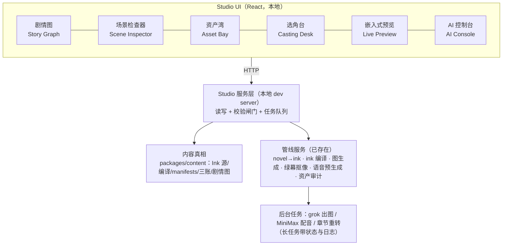

# SPEC-0004: Creator Studio as an AI-native VN production cockpit

Owner 于 2026-07-18 明确：Creator Studio 是本项目的第二产品线——游戏发布后，
"AI 把小说变成可玩互动电影"的这套管线本身就是可售卖的创作工具。本规格给出
全局架构、分期路线与界面草案；实施按分期逐步进行，不一次性重写。

## 1. 产品定位（为什么它能成为独立产品）

市面对照：Inky 只编辑 Ink 文本；Twine/Tuesday.js 是"编辑器+引擎"绑死的一体机；
Naninovel 收费且限 Unity。没有一个是 **AI-native** 的：输入小说，产出带立绘、
配音、AI 支线的可玩作品。SupaLuv 仓库里已经存在这条完整管线（小说→Ink 技能、
资产生成技能、绿幕抠像、预生成配音、剧情图生成、验收测试），只是散落成
AI 才会用的脚本。**Creator Studio 的本质 = 给这条管线装一个人类能开的驾驶舱。**

三类用户，按时间顺序服务：

1. **Owner/作者**（现在）：不写代码，改场景、换立绘、试配音、跳场景预览。
2. **AI 代理**（现在）：Claude/grok/codex 走同一套本地 API 无头操作——
   UI 和 AI 用同一个服务层，人机同权。
3. **第三方创作者**（产品期）：带账号、云存储、发布与计费。

## 2. 铁律（架构不变量）

- **编辑器不是第二个真相源。** Studio 只读写游戏本来就消费的那些文件
  （Ink 源码、scene manifests、资产三账、语音库、生成图）。删掉 Studio，
  游戏内容一个字节都不变。
- **写入必须过管线闸门。** 保存 = 校验（schema/编译/图生成/资产审计）通过后
  落盘；闸门失败则拒绝写入并解释。已有的 hash 防冲突保留。
- **人与 AI 走同一 API。** 每个 UI 按钮背后是一条 HTTP/CLI 可调用的服务；
  AI 代理不需要 UI 就能做同样的事。
- **内容包保持引擎可迁移**（Unity/Godot/Ren'Py），Studio 不引入任何
  只有本运行时才懂的私有格式。

## 3. 架构分层



关键点：UI 六个模块共享一个服务层；服务层下面是**已经存在**的管线脚本，
Studio 不重写它们，只编排它们。

## 4. 模块与现状

| 模块 | 现状 | 目标 |
| --- | --- | --- |
| 剧情图 | ✅ 已有（React Flow，只读+选中） | 保留；增加"从此场景预览"入口 |
| 场景检查器 | ⚠️ 只能改单行 Ink 文本 | 改场景级字段：speaker/artKey/portraits/aiBranch；下拉选值来自 registry/三账，不许自由填错 |
| Ink 文本编辑 | ⚠️ 单行 CodeMirror | 升级为 knot 级编辑；重文本工作链接 Inky（不重造 Inky） |
| 资产湾 | ❌ 无 | 浏览三账资产；对着某资产写提示词发 grok 重生成，产出进候选区，人点"采纳"才入账 |
| 选角台 | ❌ 无 | 每角色立绘缩略图 + 音色试听（现成 /tts/preview 扩展）；改音色 = 改 CHINESE_VOICE_MAP + 触发语音库增量重生成 |
| 嵌入式预览 | ⚠️ 有 jumpTo 内部机制（?prop-stage-fixture） | 图上任意场景一键"从这里开始玩"，iframe 内嵌真实游戏 |
| AI 控制台 | ❌ 无 | 一键任务：重转某章 / 重生成语音库 / 资产审计；任务队列 + 实时日志 |

## 5. 分期路线

- **P0（服务自己，最先做）**：场景检查器（场景级字段编辑+校验落盘）、
  一键"编译+图生成+校验"、图上任意场景嵌入式预览。价值：owner 从此能自己
  改场景、换背景、调 AI 支线触发点。
- **P1（产品雏形）**：资产湾 + 选角台 + AI 控制台（任务队列）。价值：
  完整"小说进、游戏出"驾驶舱，owner 不再需要在对话里指挥 AI 干杂活。
- **P2（产品化，游戏发布后）**：多项目工作区、账号与云存储（SwimmerBackend）、
  发布导出（Web bundle 一键部署；Ren'Py/Unity 导出走可迁移内容包）、
  电池计费接 AI 任务。**P2 前不做任何账号/计费代码。**

## 6. 界面草案（P0 布局）

```
┌────────────────────────────────────────────────────────────┐
│ SupaLuv Creator Studio          [章节▾] [校验状态●] [任务⚙] │
├───────────────┬───────────────────────┬────────────────────┤
│               │                       │  场景检查器          │
│   剧情图       │    嵌入式预览          │  id: dch01_s011    │
│  (React Flow) │  (真实游戏 iframe,     │  speaker: [苏明 ▾] │
│   点选场景 ────┼──▶ 从选中场景开始)     │  artKey: [缩略图▾]  │
│               │                       │  portraits: [+]    │
│               │                       │  aiBranch: [开关]   │
│               │                       │  ── Ink 文本 ──    │
│               │                       │  (knot 级编辑)      │
├───────────────┴───────────────────────┴────────────────────┤
│ 底栏：保存(校验闸门) · 编译+图生成 · 冲突提示 · 任务日志     │
└────────────────────────────────────────────────────────────┘
```

## 7. 复用与不造轮子清单

已在用：React Flow（图）、CodeMirror（文本）、inkjs（编译/运行）。
新增复用：ink 语法高亮用社区 CodeMirror ink 模式（有则用，无则先纯文本）；
重度 Ink 写作导向 Inky（官方免费）而非重造；任务队列 P0/P1 用进程内简单实现，
不引消息中间件。自研仅限：管线编排服务层与六模块 UI——这正是产品差异化所在，
没有现成开源等价物（有的话直接用）。

## 8. 验收方式

- P0：owner 在不打开代码编辑器的前提下，完成一次"改场景背景 + 改说话人 +
  移动 AI 支线触发点 + 从该场景实玩验证"的闭环，全程 Studio 内完成。
- 每期结束跑完整验证门（typecheck/test/e2e/build），Studio 改动不得破坏游戏。
